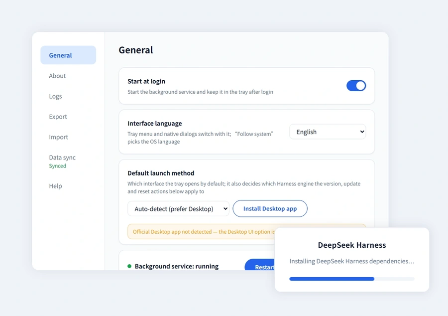

<h1 align="center">
  
  <br />
  dsh-systray
</h1>

<p align="center">
  Launches the
  <a href="https://github.com/deepseek-ai/deepseek-harness">DeepSeek Harness</a>
  Web server in the background and lives in the system tray.
</p>

<p align="center">
  <a href="README.md">简体中文</a> · <a href="README.en.md">English</a>
</p>

<p align="center">
  <a href="https://github.com/refyon/dsh-systray/releases/latest"></a>
  
  
  <a href="https://github.com/refyon/dsh-systray/actions/workflows/release.yml"></a>
</p>



A Windows / macOS system-tray app. Three core traits: **Lightweight** (single file, no install, no admin rights, tray residency), **Reliable** (environment self-check & self-healing, rollback on startup failure, rollback on update failure), **Portable** (account sync plus export/import of sessions, plugins and folders). Seven settings pages, bilingual UI, light/dark follows the system.

> [!IMPORTANT]
> A community-maintained, unofficial tool that depends on `@deepseek-ai/dsh`. The macOS build is not notarized and the Windows build is not signed, so the first run needs a manual allow. First launch takes about 2–5 minutes to deploy the environment.

## System requirements

| Platform | Requirement |
| --- | --- |
| Windows | **Windows 10 1803+ / Windows 11**; [WebView2 Runtime](https://developer.microsoft.com/microsoft-edge/webview2/) (preinstalled with Microsoft Edge, installed automatically when missing) |
| macOS | macOS 11.0+ |

## Download

| Platform | Architecture | Package | Download |
| --- | --- | --- | --- |
| Windows | x64 | ZIP | [Download for Windows](https://github.com/refyon/dsh-systray/releases/latest/download/dsh-systray-windows-x64.zip) |
| macOS | Intel + Apple Silicon | ZIP (.app) | [Download for macOS](https://github.com/refyon/dsh-systray/releases/latest/download/dsh-systray-macos-universal.zip) |

Unzip and run: the first launch deploys the runtime and harness with progress shown in the window, then offers a one-click "open Web UI"; afterwards it starts with the system.

## Features

**Lightweight**

- Double-click to start: launches the harness Web service (loopback only); startup progress is shown in the window
- Single file, no install: one exe on Windows, one .app on macOS, no admin rights; portable Node.js / pnpm provisioned on demand
- Tray residency: "Open Web UI / Settings / Quit" menu; light/dark follows the system
- Single instance: a second launch reports "already running"

**Reliable**

- Startup self-check of node / pnpm / harness, installed automatically when missing
- On startup failure it rolls back to the last known-good state and restarts
- Plugins incompatible with the current harness version are marked "Skipped" on the About page with the reason
- "Restart service" takes about 4–5 s; a service process that exits is relaunched within 5 minutes (at most 3 times)
- dsh-systray / Harness / plugins are checked independently; failures roll back automatically
- Private-repo plugins: GitHub device-flow authorization with the one-time code shown in the window and copied to the clipboard
- The Logs page follows `dsh-systray.log` (including rotated archives), shows the full path and supports clearing

**Portable**

- Account sync (email code sign-in): start-at-login, the selected Harness version (including the prerelease channel) and every online plugin; machine-specific settings and local plugins are never uploaded
- Pulled changes apply via "restart to apply"; machines merge by newest, and failed items can be retried
- Export / Import: sessions, installed plugins and chosen folders are bundled into a zip; import lists restorable items and prompts on conflicts with backups
- Config lives in `config.json`, data in `~/.dsh`

**Official Desktop app**

- When the Desktop app is detected, the tray's "Open Web UI" becomes "Open Desktop UI"
- Default launch method (settings dropdown): `auto` / `web` / `desktop`
- Version, update and reset follow the launch method; Desktop UI uses the official update feed
- Under Desktop UI, entries that only affect the tray-managed service are greyed out or hidden

## Configuration

`config.json` lives in the user config directory (optional; defaults apply when missing):

```json
{
  "port": 3080,
  "harnessDir": "~/deepseek-harness",
  "startupTimeoutSec": 300,
  "updateMirror": "",
  "mirrorBase": "",
  "harnessPrerelease": false,
  "language": "auto",
  "proxy": "auto",
  "trustedHosts": [],
  "accountApiBase": "",
  "launchTarget": "auto"
}
```

| Key | Description | Environment variable |
| --- | --- | --- |
| `port` | Server port, default 3080 | `DSH_SYSTRAY_PORT` |
| `harnessDir` | Harness source / install directory, default `~/deepseek-harness` | `DSH_SYSTRAY_HARNESS_DIR` |
| `startupTimeoutSec` | Startup wait timeout in seconds, default 300 | `DSH_SYSTRAY_STARTUP_TIMEOUT` |
| `updateMirror` | GitHub download mirror prefix (e.g. `https://ghproxy.net/`) | — |
| `mirrorBase` | Self-hosted GitHub relay URL | — |
| `harnessPrerelease` | Treat alpha/beta/rc as updateable versions | — |
| `language` | UI language: `auto` (follow system) / `zh` / `en` | `DSH_SYSTRAY_LANG` |
| `proxy` | Outbound proxy: `auto` / `direct` / a proxy URL | `DSH_SYSTRAY_PROXY` |
| `trustedHosts` | Extra trusted addresses (`host:port`) | — |
| `accountApiBase` | Account-sync service URL; sign-in state lives in `account.json` (0600) beside it | — |
| `launchTarget` | Default launch method `auto` / `web` / `desktop` | `DSH_SYSTRAY_LAUNCH_TARGET` |

## Building

Prerequisites: Go 1.21+ and the [Wails CLI v2](https://wails.io/docs/gettingstarted/installation) (`go install github.com/wailsapp/wails/v2/cmd/wails@v2.15.0`).

Run the commands inside `src/`; on Windows you can also use `scripts\build.ps1`.

| Platform | Build command (run inside `src/`) |
| --- | --- |
| Windows | `wails build -s -clean -platform windows/amd64 -ldflags "-X main.appVersion=v1.2.3"` |
| macOS | `wails build -s -clean -platform darwin/universal -ldflags "-X main.appVersion=v1.2.3"` |

- Output: `src/build/bin/dsh-systray.exe` / `dsh-systray.app`
- `-X main.appVersion=`: version used for update comparison (injected from the CI tag; `dev` when omitted, which skips update checks)
- Windows: add `-webview2 download` to cover machines without WebView2

## Development

```bash
cd src
wails dev
```

Debug environment variables: `DSH_SYSTRAY_PORT`, `DSH_SYSTRAY_HARNESS_DIR`, `DSH_SYSTRAY_STARTUP_TIMEOUT`, `DSH_SYSTRAY_LOG_DIR`, `DSH_SYSTRAY_LANG`, `DSH_SYSTRAY_PROXY`.

## Links

[Website](https://refyon.github.io/dsh-systray/) · [Release notes](https://github.com/refyon/dsh-systray/releases) · [Issues](https://github.com/refyon/dsh-systray/issues) · Related: [DeepSeek Harness](https://github.com/deepseek-ai/deepseek-harness)
