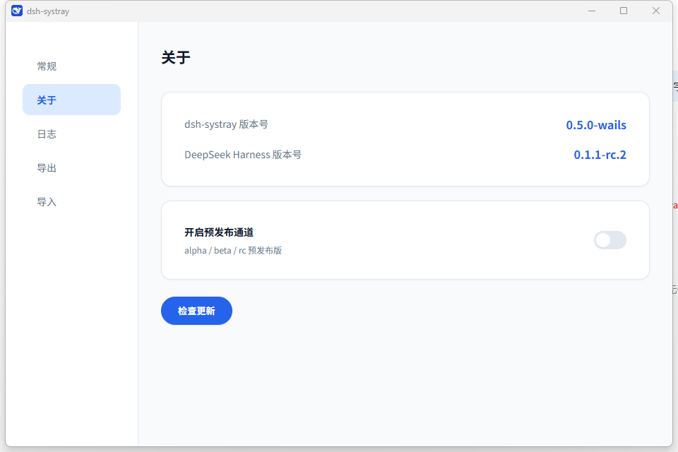

<h1 align="center">
  
  <br />
  dsh-systray
</h1>

<p align="center">
  后台启动
  <a href="https://github.com/deepseek-ai/deepseek-harness">DeepSeek Harness</a>
  Web 本地服务器，并常驻系统托盘。
</p>

<p align="center">
  <a href="https://refyon.github.io/dsh-systray/"><strong>网站</strong></a> ·
  <a href="https://github.com/refyon/dsh-systray/releases/latest">更新日志</a>
</p>

<p align="center">
  <a href="https://github.com/refyon/dsh-systray/releases/latest"></a>
  
  
  <a href="https://github.com/refyon/dsh-systray/actions/workflows/release.yml"></a>
</p>



dsh-systray 是一个 Windows / macOS 系统托盘应用：双击即可后台拉起 DeepSeek Harness Web 本地服务，托盘一望即知，无需记忆端口。设置窗口统一管理开机自启、dsh-systray 与 DeepSeek Harness 版本号、检查更新，托盘图标随系统深浅色自适应，内置自动更新。

> [!IMPORTANT]
> 这是一个社区维护的非官方工具，依赖快速演进的 `@deepseek-ai/dsh`。macOS 构建未经 Apple 公证，Windows 构建未做商业代码签名，首次运行可能需手动放行（Windows SmartScreen「仍要运行」/ macOS「右键 → 打开」）。首次启动约需 2–5 分钟自动部署环境。

## 下载

| 平台 | 架构 | 包 | 大小 | 下载 |
| --- | --- | --- | --- | --- |
| Windows | x64 | ZIP | 3.1 MB | [下载 Windows 版](https://github.com/refyon/dsh-systray/releases/latest/download/dsh-systray-windows-x64.zip) |
| macOS | Intel + Apple Silicon | ZIP (.app) | 5.8 MB | [下载 macOS 版](https://github.com/refyon/dsh-systray/releases/latest/download/dsh-systray-macos-universal.zip) |

## 功能

- **双击启动**：无窗口、后台拉起 harness 的 `pnpm dsh web --port <port> --no-open`
- **启动 loading**：服务启动期间显示加载窗口，就绪后弹窗提示（可一键打开 Web UI）
- **托盘右键菜单**：
  - **打开 Web UI**：用默认浏览器打开 `http://127.0.0.1:<port>/`
  - **设置**：打开设置窗口（左侧分类栏：常规-开机自启动 / 关于-版本号（dsh-systray 与 DeepSeek Harness）与检查更新 / 日志-只读可复制、可清空）
  - **退出**：关闭后台服务器进程树（含外部启动的 dsh web 服务）并退出托盘
- **单实例**：已在运行时再次双击会弹窗提示「已在运行中」，不产生第二个托盘图标
- **依赖自检**：启动时检查 node / pnpm / harness 源码，缺失时运行内置安装脚本（含 `git clone` 拉取 harness 源码）
- **自动更新**：后台自动检查 GitHub Releases 新版本，发现新版本时进度窗口下载并提示「立即更新 / 稍后」，安装完成自动重启（Windows / macOS 一致）

## 配置

`config.json` 位于用户配置目录（可选，缺失时用默认值）：

```json
{
  "port": 3080,
  "harnessDir": "/path/to/deepseek-harness",
  "startupTimeoutSec": 300,
  "updateMirror": ""
}
```

- `port`：服务器端口，默认 3080（可被环境变量 `DSH_SYSTRAY_PORT` 覆盖）
- `harnessDir`：harness 源码目录，建议显式配置为实际路径（未配置时按平台取默认值）
- `startupTimeoutSec`：服务启动等待超时（秒），默认 300（可被 `DSH_SYSTRAY_STARTUP_TIMEOUT` 覆盖）
- `updateMirror`：可选，GitHub 更新下载镜像前缀（国内网络友好，如 `https://ghproxy.net/`）

## 构建

前置：安装 Go 工具链（1.21+）。

| 平台 | 构建命令 |
| --- | --- |
| Windows | `go build -trimpath -ldflags "-s -w -H=windowsgui -X main.appVersion=v0.3.0" -o dist\dsh-systray.exe .` |
| macOS | `CGO_ENABLED=1 go build -trimpath -ldflags "-s -w -X main.appVersion=v0.3.0" -o dist/dsh-systray .` |

> `-X main.appVersion=` 注入当前版本号，供自动更新对比使用（GitHub Actions 打 tag 发布时自动注入；本地开发可省略，此时为 `dev`，跳过更新检查）。

## 平台差异

| 能力 | Windows | macOS |
| --- | --- | --- |
| 启动服务器 | `cmd /c` | `sh -c` |
| 打开 Web UI | `rundll32 url.dll` | `open` |
| 开机自启动 | 注册表 `HKCU\...\Run` | `~/Library/LaunchAgents/*.plist`（launchd） |
| 退出杀外部服务 | `netstat` + `taskkill` | `lsof` + `SIGTERM` |
| 提示方式 | MessageBox | `osascript` 通知/弹窗 |
| loading 界面 | 原生 Win32 窗口 | 系统通知 |
