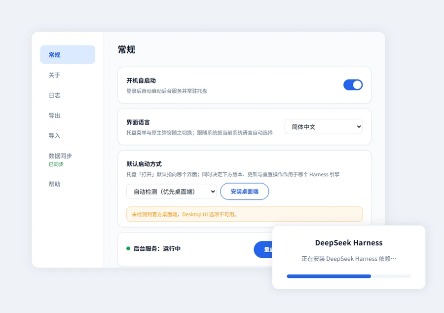

<h1 align="center">
  
  <br />
  dsh-systray
</h1>

<p align="center">
  后台启动
  <a href="https://github.com/deepseek-ai/deepseek-harness">DeepSeek Harness</a>
  Web 本地服务器，并常驻系统托盘。
</p>

<p align="center">
  <a href="README.md">简体中文</a> · <a href="README.en.md">English</a>
</p>

<p align="center">
  <a href="https://github.com/refyon/dsh-systray/releases/latest"></a>
  
  
  <a href="https://github.com/refyon/dsh-systray/actions/workflows/build-status.yml"></a>
  <a href="LICENSE"></a>
</p>



Windows / macOS 系统托盘应用。三个核心特性：**轻量**（单文件免安装、免管理员权限、托盘常驻）、**可靠**（环境自检自愈、启动失败回退、更新失败回滚）、**可迁移**（账号同步，会话 / 插件 / 目录导出导入）。设置窗口七页，界面中英双语、浅色 / 深色随系统。

> [!IMPORTANT]
> 社区维护的非官方工具，依赖 `@deepseek-ai/dsh`。macOS 构建未经公证、Windows 构建未签名，首次运行需手动放行。首次启动约 2–5 分钟部署环境。

## 系统要求

| 平台 | 要求 |
| --- | --- |
| Windows | **Windows 10 1803+ / Windows 11**；[WebView2 Runtime](https://developer.microsoft.com/microsoft-edge/webview2/)（随 Microsoft Edge 预装，缺失时自动安装） |
| macOS | macOS 11.0+ |

## 下载

| 平台 | 架构 | 包 | 下载 |
| --- | --- | --- | --- |
| Windows | x64 | ZIP | [下载 Windows 版](https://github.com/refyon/dsh-systray/releases/latest/download/dsh-systray-windows-x64.zip) |
| macOS | Intel + Apple Silicon | ZIP (.app) | [下载 macOS 版](https://github.com/refyon/dsh-systray/releases/latest/download/dsh-systray-macos-universal.zip) |

解压后双击运行；首次启动自动部署运行环境与 harness，进度在窗口内显示，就绪后可一键打开 Web UI；此后随系统开机自启。

## 功能

**轻量**

- 双击启动：后台启动 harness Web 服务（仅监听本机），启动进度在窗口内显示
- 单文件免安装：Windows 单 exe、macOS 单 .app，免管理员权限；便携 Node.js / pnpm 按需就位
- 托盘常驻：菜单「打开 Web UI / 设置 / 退出」，深浅色随系统
- 单实例：重复启动提示「已在运行中」

**可靠**

- 启动自检 node / pnpm / harness，缺失时自动安装
- 启动失败回退到上次正常运行状态并重启
- 插件与当前 harness 版本不兼容时，关于页标注「已被跳过」与原因
- 「重启服务」约 4–5 秒；服务进程退出后 5 分钟内自动拉起（最多 3 次）
- dsh-systray / Harness / 插件按模块独立检查更新，失败自动回滚
- 私有仓库插件：GitHub 设备流授权，一次性授权码显示在窗口内并复制到剪贴板
- 日志页跟踪 `dsh-systray.log`（含轮转归档），显示完整路径，支持清空

**可迁移**

- 账号同步（邮箱验证码登录）：开机自启动、最后选用的 Harness 版本（含预发布通道）、所有在线插件；本机配置与本地插件不上传
- 文件 / 文件夹同步：自选文件与目录随账号走；列表为浏览器式导航（双击进入文件夹、上方路径导航、每行显示本机完整路径）
- 容量不足只提示一次并暂停本轮同步，清理空间后点「立即同步」继续
- 拉到的改动需点「重启生效」应用；多端按最新合并，单项失败可续做
- 导出 / 导入：会话记录、已安装插件、自选文件目录打包为 zip；导入时罗列可恢复项，冲突询问并备份
- 配置存于 `config.json`，数据存于 `~/.dsh`

**官方桌面端**

- 检测到桌面端后，托盘「打开 Web UI」变为「打开 Desktop UI」
- 默认启动方式（设置页下拉）：`auto` / `web` / `desktop`
- 版本、更新与重置随启动方式切换；Desktop UI 使用官方更新源
- Desktop UI 下，只影响托盘服务的条目置灰或隐藏

## 配置

`config.json` 位于用户配置目录（可选，缺失时用默认值）：

```json
{
  "port": 3080,
  "harnessDir": "~/deepseek-harness",
  "startupTimeoutSec": 300,
  "updateMirror": "",
  "mirrorBase": "",
  "harnessPrerelease": false,
  "language": "auto",
  "proxy": "auto",
  "trustedHosts": [],
  "accountApiBase": "",
  "launchTarget": "auto"
}
```

| 键 | 说明 | 环境变量 |
| --- | --- | --- |
| `port` | 服务端口，默认 3080 | `DSH_SYSTRAY_PORT` |
| `harnessDir` | harness 源码 / 安装目录，默认 `~/deepseek-harness` | `DSH_SYSTRAY_HARNESS_DIR` |
| `startupTimeoutSec` | 服务启动等待超时（秒），默认 300 | `DSH_SYSTRAY_STARTUP_TIMEOUT` |
| `updateMirror` | GitHub 下载镜像前缀（如 `https://ghproxy.net/`） | — |
| `mirrorBase` | 自建 GitHub 中转地址 | — |
| `harnessPrerelease` | 是否把 alpha/beta/rc 视为可更新版本 | — |
| `language` | 界面语言 `auto`（跟随系统）/ `zh` / `en` | `DSH_SYSTRAY_LANG` |
| `proxy` | 出网代理 `auto` / `direct` / 代理地址 | `DSH_SYSTRAY_PROXY` |
| `trustedHosts` | 额外信任的访问地址（`host:port`） | — |
| `accountApiBase` | 账号同步服务地址；登录态在同目录 `account.json`（0600） | — |
| `launchTarget` | 默认启动方式 `auto` / `web` / `desktop` | `DSH_SYSTRAY_LAUNCH_TARGET` |

## 构建

前置：Go 1.21+、[Wails CLI v2](https://wails.io/docs/gettingstarted/installation)（`go install github.com/wailsapp/wails/v2/cmd/wails@v2.15.0`）。

命令在 `src/` 下执行；Windows 也可用 `scripts\build.ps1`。

| 平台 | 构建命令（在 `src/` 下执行） |
| --- | --- |
| Windows | `wails build -s -clean -platform windows/amd64 -ldflags "-X main.appVersion=v1.3.5"` |
| macOS | `wails build -s -clean -platform darwin/universal -ldflags "-X main.appVersion=v1.3.5"` |

- 产物：`src/build/bin/dsh-systray.exe` / `dsh-systray.app`
- `-X main.appVersion=`：版本号（CI 按 tag 注入；省略时为 `dev`，跳过更新检查）
- Windows 可加 `-webview2 download`（为未预装 WebView2 的机器兜底）

## 测试

```bash
cd src && go test ./...                    # Go：文件同步 / 账号 / 更新 / 服务守护等回归
node scripts/check-frontend-i18n.mjs       # 文案键齐全：静态 data-i18n ↔ I18N_EN、tr/fmt/msg 字面量 ↔ I18N_DYN
node scripts/check-frontend-files-card.mjs # 文件列表：容量换算、目录树聚合、排序、行渲染、导航与路径行规则
node scripts/check-frontend-lang.mjs       # 真实浏览器：7 个页面 × 中英基线 + 运行中切换语言 + 交互场景（需本机 Edge/Chrome）
```

界面文案改动请至少跑后三条：前两条是静态/纯函数检查，第三条会用同一份界面比对
「以目标语言直接启动」与「切换语言后」的逐元素文案，漏刷新的按钮/提示会被直接列出
（`--shot 目录/` 可顺带截图复核，`--page sync` 只查指定页）。真实安装包层面的操作
（安装位置、开机自启、系统对话框取消等）仍需在真机走一遍。

## 开发

```bash
cd src
wails dev
```

调试环境变量：`DSH_SYSTRAY_PORT`、`DSH_SYSTRAY_HARNESS_DIR`、`DSH_SYSTRAY_STARTUP_TIMEOUT`、`DSH_SYSTRAY_LOG_DIR`、`DSH_SYSTRAY_LANG`、`DSH_SYSTRAY_PROXY`。

## 贡献

欢迎 issue 与 pull request。动手前请先读 [CONTRIBUTING.md](CONTRIBUTING.md)：里面有开发环境、提交前必须跑的四条检查，以及本项目「代码注释与提交信息用中文、界面文案走 i18n」的约定。

- 缺陷 / 功能建议：[新建 issue](https://github.com/refyon/dsh-systray/issues/new/choose)（已提供模板）
- 安全漏洞：**不要**开公开 issue，走 [SECURITY.md](SECURITY.md) 的私密报告渠道
- 界面设计改动须遵循 [DESIGN.md](docs/DESIGN.md)（颜色与间距走 token、弹窗必须前台）

## 安全

构建未签名：macOS 版未经公证、Windows 版未签名，首次运行需手动放行；应用会把数据写入 `~/.dsh` 与自身配置目录，开启自启动时会写注册表 / 启动项。漏洞报告方式与范围界定见 [SECURITY.md](SECURITY.md)。

## 许可

[MIT](LICENSE) © 2026 RefyonLab

仓库自身的代码按 MIT 授权；运行时会按需下载并在本机部署 Node.js、pnpm 与 DeepSeek Harness，这些组件各自遵循其上游许可。

## 相关链接

[网站](https://refyon.github.io/dsh-systray/) · [DeepSeek Harness](https://github.com/deepseek-ai/deepseek-harness) · [Wails](https://wails.io/)
